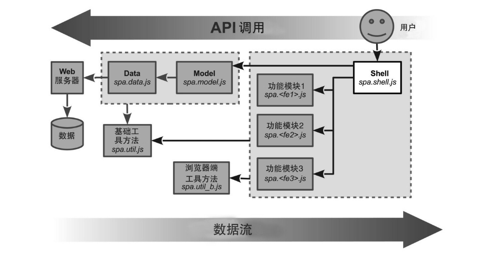

* 描述Shell模块以及它在架构中的地位 

* 组织文件和名字空间 

* 创建功能容器，并为之设计样式 

* 使用事件处理程序来切换功能容器 

* 使用锚接口模式来管理应用的状态 

#### 3.1 深刻理解Shell 

Shell是单页应用的主控制器(master controller)： 

对比飞机外壳，所有配件使用各种紧固件附着在机身上，并被做成尽可能独立工作。 

架构的中枢。 是功能模块和业务逻辑以及通用浏览器接口（像URI或者cookie）之间的协调者。

Shell模块是单页应用的形状和结构。协调所有从属功能模块的控制器。

适用Shell的架构如下图所示。



负责的事情：

* 渲染和管理功能容器
* 管理应用状态
* 协调功能模块

#### 3.2 创建文件和名字空间

每个JavaScript名字空间都会有一个对应的JavaScript文件，并且使用自执行匿名函数，以免污染全局名字空间。也会建立平行的CSS文件结构。（利于加快开发、提升质量和简化维护）

##### 3.2.1 创建文件结构

选择spa作为单页应用的根名字空间。JavaScript和CSS文件名、JavaScript名字空间和CSS选择器名称都同步使用。（易于追踪）

1. 规划目录和文件

   HTML文件放在一个目录中，把CSS和JavaScript文件放在子目录中。

   spa： 根目录和根名字空间

   css： 包含所有样式表文件的目录

   js： 包含所有JavaScript文件的目录

   jq：包含jQuery的JavaScript文件（包括插件）的目录

   spa.js 提供了JavaScript根名字空间：spa。有一个对应的样式表文件：css/spa.css

   spa.shell.js 提供了Shell名字空间：spa.shell。有一个对应的样式表文件：css/spa.shell.css

2. 安装jQuery和插件

   jQuery库提供了跨平台DOM操作和其他工具方法。

   jQuery的uriAnchor插件提供了管理URI的锚组件的工具方法。[uriAnchor插件](<https://github.com/mmikowski/urianchor/blob/master/jquery.uriAnchor.js>)

##### 3.2.2 编写应用的HTML文件

浏览文档(spa/spa.html)总是保持很小的体积。它唯一的角色是加载库和样式表，然后启动应用。

脚本文件在html的位置：

* 传统网页：放在body容器的最后面 - 静态的HTML和CSS在JavaScript加载完成前就能显示->使页面渲染更快

* 单页应用：放在头部 - SPA使用JavaScript来生成HTML，放在头部之外，并不能更快渲染页面，放在head中，以便改进组织结构和易读性

##### 3.2.3 创建CSS根名字空间

根名字空间是spa > 根样式表应该叫做spa/css/spa.css

根样式表 > 多一些reset和通用 样式

文件中所有的css id和class都以spa-为前缀

##### 3.2.4 创建JavaScript根名字空间

根名字空间spa > 根JavaScript应该叫做spa/js/spa.js。

必需的JavaScript至少是var spa = {};

添加一个初始化应用的方法，确保代码通过JSLint的验证。（附录A）没有任何常见的错误和不好的写法

**附录A-> 如何安装和运行JSLint （A.9 验证代码）**

1.下载：https://code.google.com/archive/p/jslint4java/

2.选择安装包[jslint4java-2.0.5-dist.zip](https://storage.googleapis.com/google-code-archive-downloads/v2/code.google.com/jslint4java/jslint4java-2.0.5-dist.zip)

3.移动jar文件： sudo mv jslint4java-2.0.5.jar /usr/local/lib

4.创建包装器wrapper: sudo vim /usr/local/bin/jslint

```bash
#!/bin/bash
# See http://code.google.com/p/jslint4java/

for jsfile in $@;
do /usr/bin/java \
  -jar /usr/local/lib/jslint4java-2.0.5.jar \
  "$jsfile";
done
```

5.确保可用（修改权限）： sudo chmod 755 /usr/local/bin/jslint

Node方式安装：npm install -g jslint

**配置JSLint**

```javascript
/* jslint 			browser: true,	continue: true,
 	devel: true,	indent: 2,		maxerr: 50,
 	newcap: true,	nomen: true,	plusplus: true,
 	regexp: true,	sloppy: true,	vars: false,
 	white: true
 */
```

**使用JSLint**

jslint filepath1 [filepath2, ... filepathN]

**在git的提交钩子脚本（hook），测试所有更改的JavaScript文件**

更改repo/.git/hooks/pre-commit

```shell
#!/bin/bash
  
# See www.davidpashley.com/articles/writing-robust-shell-scripts.html
# unset var check
set -u;
# exit on error check
# set -e;

BAIL=0;
TMP_FILE="/tmp/git-pre-commit.tmp";
echo;
echo "JSLint test of updated or new *.js files ...";
echo " We ignore third_party libraries in .../js/third_party/...";
git status \
  | grep '.js$' \
  | grep -v '/js/third_party/' \
  | grep '#\s\+\(modified\|new file\)' \
  | sed -e 's/^#\s\+\(modified\|new file\):\s\+//g' \
  | sed -e 's/\s+$//g' \
  | while read LINE; do
      echo -en "  Check ${LINE}: ..."
      CHECK=${jslint $LINE};
      if [ "${CHECK}" != "" ]; then
        echo "FAIL";
      else 
        echo "pass";
      fi;
    done \
  | tee "${TMP_FILE}";
  
echo "JSLint test complete";
if grep -s 'FAIL' "${TMP_FILE}"; then
  echo "JSLint testing FAILED";
  echo " Please use jslint to test the failed files and ";
  echo " commit again once they pass the check.";
  exit 1;
fi
echo;
exit 0;
```

确保可执行：chmod 755 pre-commit

提交没有进入while循环？？

